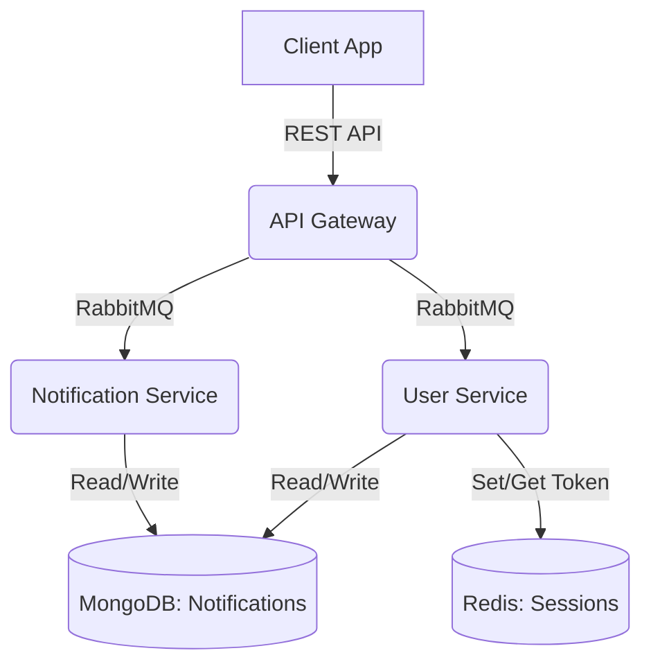
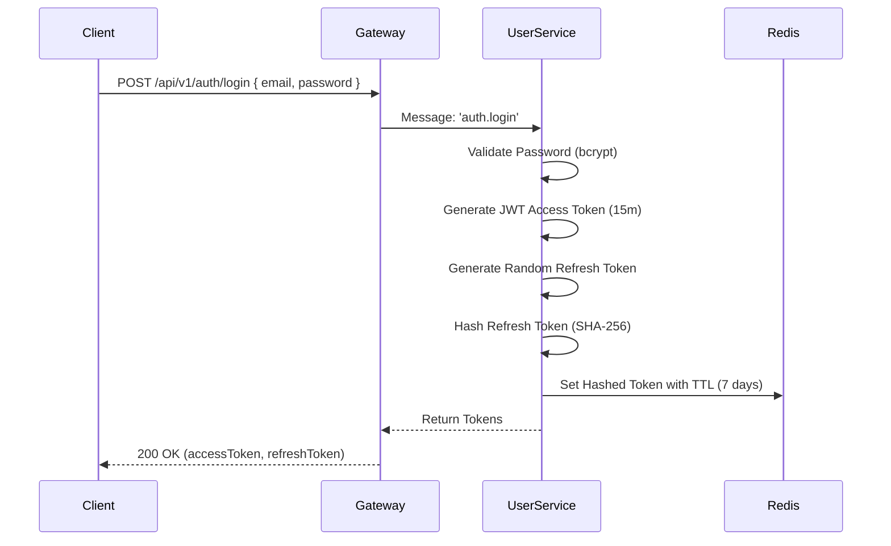

# Architecture Overview

The Dedisalam backend system is built on a **Hybrid Microservices Architecture** using **NestJS**.

## Core Components

### 1. API Gateway (`apps/gateway`)
The entry point for all client requests. It exposes RESTful APIs to the frontend and routes requests to the appropriate downstream microservice using a message broker.
- **Protocol**: HTTP/REST
- **Validation**: Global `ValidationPipe` with `class-validator` DTOs.
- **Communication**: Sends asynchronous messages to microservices via RabbitMQ.

### 2. User Service (`apps/user-service`)
Responsible for all user identity and authentication operations.
- **Database**: MongoDB (Stores User credentials and profiles)
- **Caching/Session**: Redis (Stores hashed refresh tokens with TTL)
- **Dependency Injection**: Uses a Singleton `useFactory` pattern in `RedisModule` to globally export the `REDIS_CLIENT` token, minimizing connection pool overhead.
- **Security**: Uses bcrypt (Cost Factor: 10) for password hashing and JSON Web Tokens (JWT) for stateless access validation.

### 3. Notification Service (`apps/notification-service`)
Responsible for persisting and retrieving user notifications.
- **Database**: MongoDB
- **Trigger**: Receives events from other services (e.g., User Service) via RabbitMQ.

## Communication Flow

All internal communication between the Gateway and microservices happens via **RabbitMQ**. This decouples the services, ensuring that if a downstream service goes offline, the Gateway does not crash (incorporating timeouts for fast-failing).

## Authentication Flow (JWT + Refresh Token)

